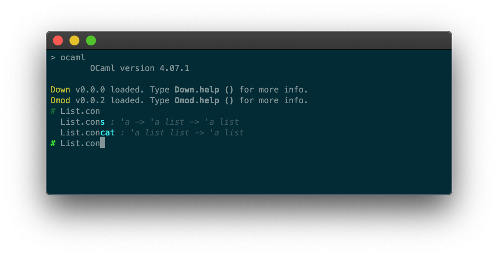

down — An OCaml toplevel (REPL) upgrade
-------------------------------------------------------------------------------
%%VERSION%%

Down is an unintrusive user experience upgrade for the `ocaml`
toplevel (REPL). 

Simply load the zero dependency `Down` library in the `ocaml` toplevel
and you get line edition, history, session support and identifier
completion and documentation (courtesy of [`ocp-index`][ocp-index]).

Add this to your `~/.ocamlinit`:

    #use "down.top"



Down is distributed under the ISC license.

Homepage: http://erratique.ch/software/down

[ocp-index]: https://github.com/OCamlPro/ocp-index

## Installation

down can be installed with `opam`:

    opam install down

If you don't use `opam` consult the [`opam`](opam) file for build
instructions.

## Quick start 

Simply run `ocaml` and load the library:

```
> ocaml
...
# #use "down.top";;
Down loaded. Type Down.help () for more info.
# List.con^t
  List.cons : 'a -> 'a list -> 'a list
  List.concat : 'a list list -> 'a list
# List.con
```

You can add this `#use "down.top"` invocation to your `~/.ocamlinit` file.

For `ocamlnat` you will likely have to invoke it with `-noinit` and you
must issue `#use "down.nattop"`.


## Documentation

The manual can be consulted [online][doc] or via `odig doc down`.

[doc]: http://erratique.ch/software/down/doc
